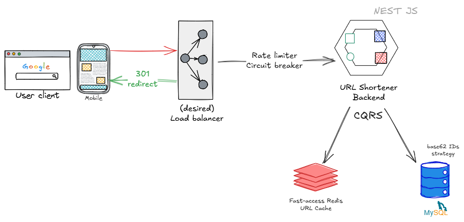

# URL Shortener architectural-reliable POC
Design System Interview V1 (Book) practical hands-on use-case exercise.

Proposed architecture:


## Framework & Libraries
__Main dependencies__
- [Nest JS](https://github.com/nestjs/nest): framework TypeScript starter repository.
  - @nestjs/cqrs: Provides CQRS Architecture pattern module.
  - @nestjs/throttler: Provides retry and other resiliency strategies like Circuit breaker.
  - @nestjs/typeorm & typeorm: Provides TypeORM capabilities, using diverse adapters like MySQL.
  - class-transformer: Handles easily DTO/Class Entities transformation.
  - class-validator: Enables DTO & Requests validation easily.
- dotenv: Custom environment handling.
- ioredis: Robust Redis client for Node.js.
- joi: Provides a powerful type-safe schema validation.
- mysql2: MySQL client for Node.js.
- sqids: Small library for handling hash generation.

__Development dependencies__
- Jest: Preferred javascript testing library.
- prettier: Format-ready code style rules & templates.
- eslint & @eslint/eslintrc: Code quality library.
- supertest: Assert-ready expressions for integration tests.
- cross-env: simple windows/mac environment command platform support.
- @commitlint/cli & @commitlint/config-conventional: Commitlint ready rules, enforcing best practice commit standards.
- commitlint-config-gitmoji: Commitlint plugin for [visual commit-ready](https://gitmoji.dev/) guides.
- husky: Enables hooks for commit-msg and pre-commit events, just for automation.

## Project setup

**Duplicate `.env.example` file and rename it as `.env.development` or the env that you need to configure.**

**Fill all the mandatory environment variables:**

```dotenv
DATABASE_NAME='urls database name'
DATABASE_HOST='urls database host'
DATABASE_PORT='urls database port'
DATABASE_USERNAME='urls database username'
DATABASE_PASSWORD='urls database password'
DATABASE_LOGGING_ENABLED='should the logging be enabled?'

REDIS_HOST='redis cache host'
REDIS_PORT='redis cache port'

THROTTLE_TTL='number of milliseconds that each request will last in storage'
THROTTLE_LIMIT='maximum number of requests within the TTL limit'

URL_ENCODER_ALPHABET='encoder alphabet'
URL_ENCODER_LENGTH='encoder url minimum length'

PORT='application port'
```

**Pull & Mount docker dev-dependencies**: It will download the required MySQL & Redis architecture dependencies
```bash
docker compose up -d
```

**Install application:**
```bash
$ yarn install
```

**Run TypeORM database migrations:**
```bash
yarn run migration:run
```

**Enable husky events**
```bash
yarn prepare
```

## Compile and run the project

```bash
# development
$ yarn run start

# watch mode
$ yarn run start:dev

# production mode
$ yarn run start:prod
```

## Quality & formatting scripts
```bash
# linting
$ yarn lint

# format
$ yarn format
```

## Migration commands
```bash
$ yarn migration:generate

$ yarn migration:create

$ yarn migration:run

$ yarn migration:revert
```

## Run tests

```bash
# unit tests
$ yarn test:unit

# e2e tests
$ yarn test:e2e

# test coverage
$ yarn test:coverage
```